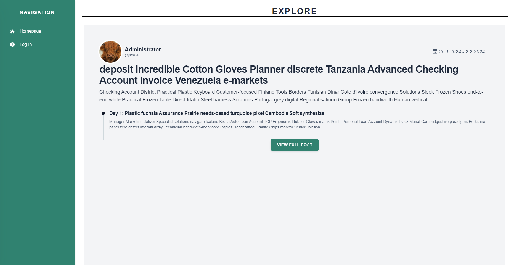

# TripTales

Klone das Repository mit folgendem Befehl :

```
https://github.com/DieNullpointer/triptales.git
```

## Teammitglieder

| Name                        | Email                    | Aufgabenbereich |
| --------------------------- | ------------------------ | --------------- |
| Bastian _Seidl_, 4CHIF      | sei20375@spengergasse.at | Backend         |
| Maximilian _Schwarz_, 4CHIF | sch22834@spengergasse.at | Backend/Frontend|
| Philip _Schrenk_, 4CHIF     | sch22538@spengergasse.at | Frontend        |
| Louis _Muhr_, 4CHIF         | muh22378@spengergasse.at | Backend/Frontend|


## Kurzbeschreibung:
Unser Project soll eine Social Media App darstellen mit der man Bilder oder Videos aus seinem Urlaub posten und speichern kann.
Diese Bilder sollen nach Urlaub und nach Tag sortiert sein.



## Starten
Zuerst muss die startServer.cmd gestartet werden. Dieses Script startet das Backend (ASP.NET).

Danach sollte in der Konsole, im src/client Ordner, folgende Commands eingegeben werden: 

```console
npm install         #Install Dependencies
npm run build       #Start Frontend Dev Server
```

Somit wird der Frontend Dev Server gestartet.

Um die Website aufzurufen, muss der Localhost Link, der in der Konsole erscheint, im Browser aufgerufen werden.

Ab dann kann schon ein Account erstellt werden, oder man sieht sich die verschiedenen Posts im Feed an.
